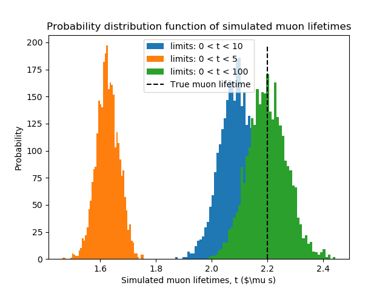

# Week 3 Checkpoint
### How to run simulation

In order to run the simulation, run the the following command in the terminal:
~~~
python runSimulation.py
~~~

### Discussion on results

If we look at the frist figure, representing a histogram of the 1000 randomly sampled muon lifetimes, we note that the lifetimes were sampled within a finite range (in the case of this distribution, the limits are within $t_{\mu} \in [0, 10]$). This will result in there being a systematic undercounting of the muon lifetimes when we randomly sample from our defined exponential distribution. This is the source of the primary bias in our simulation.

By increaing the upper bound of our limits from which we are sampling the muon lifetimes, we will get reduce the sistematic error in our bias and will get distribution of simulated lifetimes which are closer to the truth muon lifetime. The oposit is also true, hence by reducing the upper bounds of the limit, we will increase our bias and get a larger systematic error. This can be seen in the second figure seen below.

The precision of a single simulated muon lifetime is primarily limited by the standard error of the mean, which is given by $E_{mean} = \frac{\sigma}{\sqrt{N}}$ where N is the umber of samples used to compute the mean. This means that our precision is dependent on how many random samples we take from the exponential distribution.

